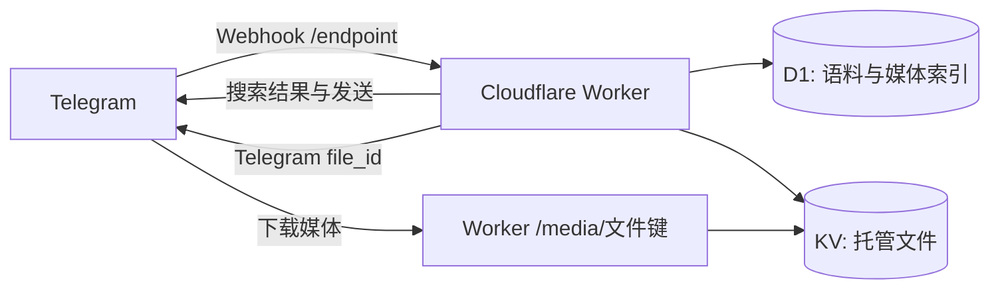

<div align="center">

# TeleShelf · 电报素材架

**把台词、图片和声音放上架，在 Telegram 里随搜随发。**


一个运行在 Cloudflare Workers 上的 Telegram 内联素材机器人。
支持文字语料、图片、音频和语音；代码留在 GitHub，内容存放在 Cloudflare 或 Telegram。

[开始使用](#开始使用) · [自己部署](#自己部署) · [命令参考](#命令参考) · [架构](#架构)

</div>

## 能做什么

- **随搜随发**：在聊天输入 `@机器人 关键词`，选择匹配的文字或媒体。
- **媒体收录**：管理员直接上传图片、音频、语音，或添加外部 HTTPS 文件直链。
- **语料管理**：单条添加、批量导入、分类检索、导出和可恢复删除。
- **多机器人共用代码**：同一个 D1 数据库按机器人隔离条目与权限。
- **持久状态**：管理员授权、批量输入状态、Webhook 去重记录保存在 D1。
- **轻量部署**：不需要常驻服务器，使用 Workers 默认域名即可启动。

## 开始使用

将下面的 `@YourBot` 替换为你自己部署的机器人用户名，在 Telegram 聊天输入：

```text
@YourBot 关键词
@YourBot 图片 关键词
@YourBot 音频 关键词
@YourBot 语音 关键词
```

搜索匹配分类与标题；多个关键词以“任一匹配”查询。空查询随机展示10条，关键词查询每页最多50条。通过内联机器人发送的媒体不会被再次收录。


管理员上传媒体时，在说明中写 `{分类}标题`，例如 `{表情包}猫猫震惊`。没有说明时，音频使用已有标题或文件名，其他媒体生成默认标题。建议显式填写标题以便搜索。

## 命令参考

| 命令 | 用途 |
| --- | --- |
| `/start`、`/help` | 启动和帮助 |
| `/search 关键词` | 在当前聊天发送最多5条搜索结果 |
| `/photo 关键词`、`/audio 关键词` | 在当前聊天搜索并发送媒体 |
| `/update_file {分类}内容` | 添加文字，需管理权限 |
| `/batch_add` | 进入5分钟批量输入模式 |
| 上传 `.txt` | 按每行 `{分类}内容` 导入，上限1MB |
| `/add_photo {分类}标题 https://…` | 添加图片直链，Telegram 验证后收录 |
| `/add_audio {分类}标题 https://…` | 添加 MP3/M4A 音频直链 |
| `/list 关键词` | 查看条目ID |
| `/delete ID或关键词` | 隐藏匹配条目 |
| `/delete_category 分类` | 隐藏整个分类 |
| `/restore ID` | 恢复隐藏条目 |
| `/export` | 按分类导出有效文字为 `.txt` |
| `/refresh`、`/organize` | 查看实时数据库统计，无需重新加载文件 |
| `/password 密码` | 获取24小时管理权限，需先配置密码 |
| `/add_user ID`、`/remove_user ID` | 固定管理员管理额外授权 |
| `/list_temp_users`、`/remove_all_temp_users` | 查看或清除额外授权 |

同一机器人、类型、分类和内容自动去重。`/add_user` 授权持续有效；密码授权24小时到期。

## 架构



文字、分类和媒体索引保存在 D1。少量托管文件保存在 KV；管理员从 Telegram 上传的媒体保留在 Telegram，数据库只保存 `file_id`。外部链接首次通过 Telegram 发送验证后缓存 `file_id`。

仓库当前版本不包含语料与用户媒体。管理入口是 Telegram 命令，尚未提供网页管理后台。

## 自己部署

需要 Node.js、Cloudflare 账号和 BotFather 创建的 Telegram 机器人。通过 BotFather 的 `/setinline` 开启内联模式。

### 1. 安装并登录

```sh
git clone https://github.com/<owner>/TeleShelf.git
cd TeleShelf
npm install --global wrangler
wrangler login
```

### 2. 创建存储

```sh
wrangler d1 create teleshelf-content
wrangler kv namespace create MEDIA
```

复制 `wrangler.example.json` 为 `wrangler.local.json`，填写自己的 Worker 名称、D1 数据库名称与 ID、KV namespace ID。`BOT_NAME` 是数据库内的数据分区标识，部署后应保持稳定。

```sh
wrangler d1 execute teleshelf-content --remote --file schema.sql --config wrangler.local.json
```

### 3. 设置 Secrets

```sh
wrangler secret put BOT_TOKEN --config wrangler.local.json
wrangler secret put WEBHOOK_SECRET --config wrangler.local.json
wrangler secret put ADMIN_IDS --config wrangler.local.json
wrangler secret put ADMIN_CHAT_ID --config wrangler.local.json
```

| Secret | 格式 |
| --- | --- |
| `BOT_TOKEN` | BotFather 提供的 Token |
| `WEBHOOK_SECRET` | 自行生成的随机字符串，只使用字母、数字、下划线和短横线 |
| `ADMIN_IDS` | JSON 用户ID数组，如 `[123456789]` |
| `ADMIN_CHAT_ID` | 管理群ID，群内所有成员可以管理；无需管理群可填写 `0` |
| `ADMIN_PASSWORD` | 可选；不设置则关闭密码授权 |

Secrets 不应写入代码或提交到 Git。仓库仅提供通用示例配置；实际账号、资源ID和部署参数由部署者在本地填写。

### 4. 检查并部署

```sh
npm test
wrangler deploy --dry-run --config wrangler.local.json
wrangler deploy --config wrangler.local.json
```

访问 `https://<你的Worker地址>/health`，返回 `ok: true` 表示数据库连通。将 Telegram Webhook 设置为 `https://<你的Worker地址>/endpoint`，同时传入和 `WEBHOOK_SECRET` 相同的 `secret_token`。例如在本地终端设置环境变量后：

```sh
curl -X POST "https://api.telegram.org/bot${BOT_TOKEN}/setWebhook" \
  --data-urlencode "url=${WORKER_URL}/endpoint" \
  --data-urlencode "secret_token=${WEBHOOK_SECRET}"
```

Webhook 仅接受带正确密钥的 POST。项目不提供公开的注册/删除 Webhook 接口。部署完成后，用管理员账号上传文字或媒体即可开始收录。

## 使用边界

- 当前方案面向个人或小群体使用；容量与请求数受 Cloudflare 套餐额度约束，并非无限免费。
- `/media/` 地址公开访问，文件键不是权限控制。只上传适合公开发送、且有权使用的内容。
- 当前搜索使用字符串匹配；大语料或高流量场景需要进一步优化检索与缓存。
- 删除条目为隐藏操作，不立即删除 KV 文件；原始数据备份与存储清理由部署者管理。
- Telegram 内联 URL 音频使用 MP3；OGG Vorbis 请先转为 MP3。直接从 Telegram 上传的语音使用缓存文件ID。

## 开发与检查

```sh
npm test
node --check worker.js
```

测试覆盖语料解析、URL校验、内联媒体结果、Webhook鉴权与去重、真实 SQL 搜索、机器人数据隔离、权限、批量导入、删除恢复，以及防止内联媒体重复收录。GitHub Actions 在推送和拉取请求时自动运行检查，不部署线上机器人。

| 文件 | 内容 |
| --- | --- |
| `worker.js` | 统一机器人逻辑 |
| `schema.sql` | D1 表结构与索引 |
| `worker.test.js` | Node.js 测试 |
| `wrangler.example.json` | 可复制的部署模板 |
| `wrangler.local.json` | 自行创建的私有部署配置，不提交到 Git |
